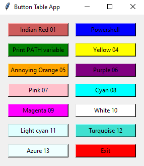
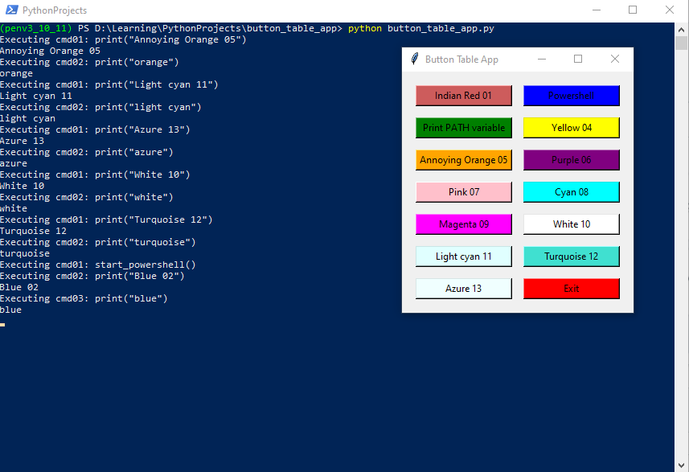
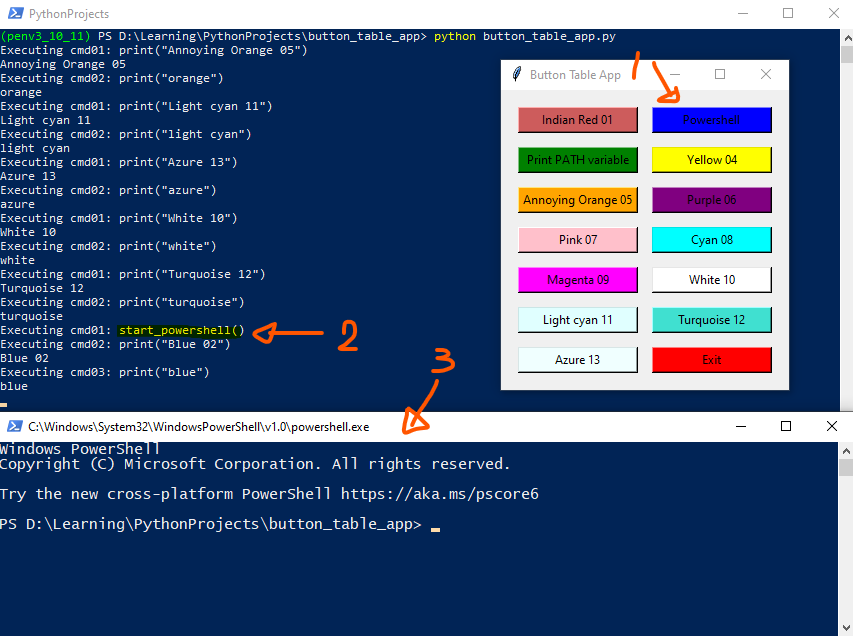

# Button Table Application

## Overview

The **Button Table Application** is a lightweight Python-based tool that enables users to define customizable buttons for automating various tasks. Each button triggers a list of user-defined commands, all configured through a simple `.json` file.


## Features
🔘 **Configurable Buttons:** Define an arbitrary number of buttons, each with its own label, color, and associated commands.

⚙️ **Custom Commands:** Associate one or more shell or Python commands with each button.

📁 **JSON-Based Configuration:** Modify button behavior and layout via a structured JSON file.

🖥️ **Cross-Platform (Where Compatible):** Designed for Python environments on Windows and Unix-like systems.

---
## Installation Requirements
* Python 3.x
* Required libraries listed in  `requirements.txt`

To install dependdencies
```
pip install -r requirements.txt
```

## Running the application

### Run with Default Configuration
```
python button_table_app.py
```

### Using a Custom Configuration
```bash
python button_table_app.py -j my_configuration.json
```


## Configuration Guide

### Editing the JSON Configuration
The default configuration file is named `button_table_app_config.json`. Update the `buttonTable` array to define new buttons or commands.

### Sample Configuration
```json
"buttonTable": [
    {
        "buttonName": "Indian Red 01",
        "buttonCommand": [
            {
                "cmd01": "print(\"Indian Red 01\")"
            },
            {
                "cmd02": "print(\"indian red\")"
            }
        ],
        "buttonColour": "indian red"
    },
    {
        "buttonName": "Print PATH variable",
        "buttonCommand": [
            {
                "cmd01": "print_path()"
            },
            {
                "cmd02": "print(\"Green 03\")"
            },
            {
                "cmd03": "print(\"green\")"
            }
        ],
        "buttonColour": "green"
    }
]
```

## Using Custom Python Functions
For more complex tasks, user-defined functions can be integrated into the configuration script. Example:
```python
def print_path():
    """User-defined function for more complicated automation""" 
    print("PATH variable:") 
    print(os.environ["PATH"])
```

**Corresponding JSON Entry**

```json
{ 
    "cmd01": "print_path()" 
}
```


---
## Graphical User Interface (GUI)
To launch the application using the default configuration:
```
python button_table_app.py
```
The following screen shows the application appearance.



The top right button named **`Powershell`** button will start a powershell on Windows.  The button named **`Print PATH variable`** will print all the **PATH** included in the **PATH** environment variable.
Each button prints its own colour. 
See screenshoot below



The following shows an additional powershell started from the **`Powershell`** button (see **1.**).
* **2.** some print from the started python function
* **3.** the started powershell



## License

This project is distributed under the terms of the MIT License. Refer to the `LICENSE` file for details.

---


*This README.md was generated with assistance from [Microsoft Copilot](https://www.microsoft.com/en-us/edge/microsoft-copilot).*  

